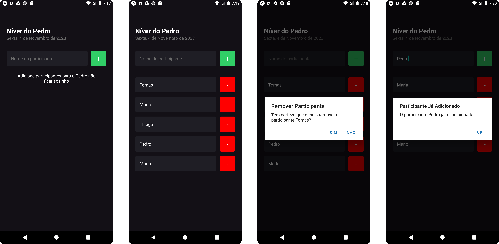

# Lista de Participantes de Evento

## Introdução

Este projeto em React Native é uma aplicação simples para gerenciar a lista de participantes de um evento específico. Ele permite aos usuários adicionar novos participantes ao evento e remover os existentes conforme necessário. Este projeto foi criado como parte de um processo de aprendizagem para entender os conceitos básicos de desenvolvimento de aplicativos móveis usando React Native.

## Tecnologias

O projeto foi desenvolvido com as seguintes tecnologias:

-   React Native: um framework JavaScript para criar aplicativos móveis nativos para Android e iOS.
-   Expo: uma plataforma de código aberto para criar aplicativos nativos universais com React.

## Imagens

